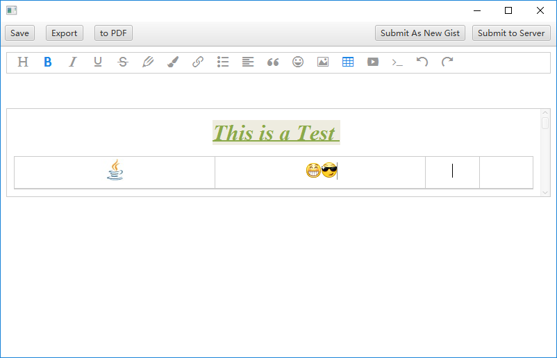
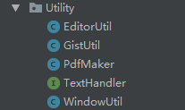

# Miki Cloud Note
@Author BJTU-161301130

## Highlights
### Powerful rich text editor based on JS and HTML

### Sina Weibo Emoji

### Sync with your gists  
#### Using REST API to get access to GitHub DataBase
  
#### TIP: Gist 经常会被墙，可能导致同步失败
**处于安全考虑，本应用设置为无法更改非本应用创建的html文档Gist，且无法对gist进行删除操作**  


### PDF exporting


## Requirement Specification
### Rich Text Editor
1. Basic operation of plain text
	1. head
	2. bold, italic
	3. Underline, Strikethrough
2. fonts and background color configuration
3. link
4. Ordered and disordered list
5. Alignment configuration
5. Quote
6. **Emoji** in Sina microblog
7. Image
8. Table
9. Code Blocks

### Local document processing
1. create a new document
2. modify the content
3. save the document in disk
4. export a copy in disk
5. remove the document from list
6. convert html document to pdf

###  Sync with github gist server
1. Github credential configuration and Remember the credential until the app exits
2. Verify if the credential is set and valid
3. Fetch gists by id or user
4. Create a new gist on the server
5. Gists editing
6. Gists submitting
7. Gists exporting to disk

## Design
### Pakage Layers  
- 
- App.Client
	- Entity class holding data of model objects
- App.Model
	- 
	- Model classes representing business entities
- App.Uility
	- 
	- Utility classes holding static methods processing data
- App.View
	- 
	- Classes and fxml files used to build GUI and define handlers
- App.Main
	- Entry of the whole application
- com.github.jhonnymertz.wkhtmltopdf.wrapper
	- APIs interacting with wkhtmltopdf
- org.eclipse.egit.github.core
	- java wrapper of github REST API

## Detailed Implementation
### Rich text editor based on javascript and html
```java
public static String generateEditorPageHtml(String contentHtml, boolean isEditable){
    try{
        File editorFile = new File("editor/editor.html");
        Document editorDoc = Jsoup.parse(editorFile,"UTF-8");

        //set the content
        editorDoc.getElementById("div2").html(contentHtml);

        //set the js reference by absolute path
        File jsFile = new File("editor/wangEditor-3.0.15/release/wangEditor.min.js");
        editorDoc.getElementsByTag("script").first().attr("src", jsFile.toURI().toURL().toString());

        //set if editable
        if(!isEditable){
            editorDoc.getElementsByTag("script").last().append("editor1.$textElem.attr('contenteditable', false)");

            //remove the tool bar
            editorDoc.getElementById("div1").remove();
        }
        //test
        System.out.println(editorDoc.outerHtml());
        return editorDoc.outerHtml();
    }catch(IOException ex){
        ex.printStackTrace();
        return null;
    }
}
```
### REST API
```java
public <V> V post(final String uri, final Object params, final Type type)
		throws IOException {
	HttpURLConnection request = createPost(uri);
	return sendJson(request, params, type);
}

public GitHubResponse get(GitHubRequest request) throws IOException {
	HttpURLConnection httpRequest = createGet(request.generateUri());
	String accept = request.getResponseContentType();
	if (accept != null)
		httpRequest.setRequestProperty(HEADER_ACCEPT, accept);
	final int code = httpRequest.getResponseCode();
	updateRateLimits(httpRequest);
	if (isOk(code))
		return new GitHubResponse(httpRequest, getBody(request,
				getStream(httpRequest)));
	if (isEmpty(code))
		return new GitHubResponse(httpRequest, null);
	throw createException(getStream(httpRequest), code,
			httpRequest.getResponseMessage());
}

public <V> V put(final String uri, final Object params, final Type type)
		throws IOException {
	HttpURLConnection request = createPut(uri);
	return sendJson(request, params, type);
}

public void delete(final String uri, final Object params)
		throws IOException {
	HttpURLConnection request = createDelete(uri);
	if (params != null)
		sendParams(request, params);
	final int code = request.getResponseCode();
	updateRateLimits(request);
	if (!isEmpty(code))
		throw new RequestException(parseError(getStream(request)), code);
}
```
### pdf exporting
```java
public static void makePdf(@NotNull String pageHtml, @NotNull String targetPath)
    throws InterruptedException, IOException{
        Pdf pdf = new Pdf();
        pdf.addPageFromString(pageHtml);
        pdf.saveAs(targetPath);
}
```
### gist sync
```java
public static void fetchGistById(String gistId, Client client) throws IOException{
    GistService gistService = new GistService();
    gistService.getClient().setCredentials(client.getCredential().getUser(), client.getCredential().getPassword());

    Gist gist = gistService.getGist(gistId);
    Note newNote = new OnlineNote(gist);
    client.getNoteMap().put(newNote.getUrl(), newNote);
}

public static void fetchGistByUser(Client client)throws IOException{
    GistService gistService = new GistService();
    gistService.getClient().setCredentials(client.getCredential().getUser(), client.getCredential().getPassword());

    List<Gist> gists = gistService.getGists(client.getCredential().getUser());
    for(Gist gist : gists){
        Note newNote = new OnlineNote(gist);
        client.getNoteMap().put(newNote.getUrl(), newNote);
    }
}
```
### concurrency
```java
public byte[] getPDF() throws IOException, InterruptedException {

    ExecutorService executor = Executors.newFixedThreadPool(2);

    try {
        Process process = Runtime.getRuntime().exec(getCommandAsArray());

        Future<byte[]> inputStreamToByteArray = executor.submit(streamToByteArrayTask(process.getInputStream()));
        Future<byte[]> errorStreamToByteArray = executor.submit(streamToByteArrayTask(process.getErrorStream()));

        process.waitFor();

        if (process.exitValue() != 0) {
            throw new RuntimeException("Process (" + getCommand() + ") exited with status code " + process.exitValue() + ":\n" + new String(getFuture(errorStreamToByteArray)));
        }

        return getFuture(inputStreamToByteArray);
    } finally {
        executor.shutdownNow();
        cleanTempFiles();
    }
}
```
### network
```java
public <V> V post(final String uri, final Object params, final Type type)
		throws IOException {
	HttpURLConnection request = createPost(uri);
	return sendJson(request, params, type);
}

public GitHubResponse get(GitHubRequest request) throws IOException {
	HttpURLConnection httpRequest = createGet(request.generateUri());
	String accept = request.getResponseContentType();
	if (accept != null)
		httpRequest.setRequestProperty(HEADER_ACCEPT, accept);
	final int code = httpRequest.getResponseCode();
	updateRateLimits(httpRequest);
	if (isOk(code))
		return new GitHubResponse(httpRequest, getBody(request,
				getStream(httpRequest)));
	if (isEmpty(code))
		return new GitHubResponse(httpRequest, null);
	throw createException(getStream(httpRequest), code,
			httpRequest.getResponseMessage());
}
```
### file IO
```java
void handleExport(){
    try{
        FileChooser fileChooser = new FileChooser();
        fileChooser.setTitle("Export to Disk");
        fileChooser.getExtensionFilters().add(new FileChooser.ExtensionFilter("HTML","*.html"));

        File target = fileChooser.showSaveDialog(editorStage);
        if(target != null){
            String contentH = EditorUtil.retrieveContentHtml(webView.getEngine().getDocument());

            FileOutputStream fos = new FileOutputStream(target);
            OutputStreamWriter writer = new OutputStreamWriter(fos, "UTF-8");
            writer.write(contentH);
            writer.flush();

            //if is a new note
            if(note.getUrl() == null){
                note.setFileName(target.getName());
                note.setUrl(target.toURI().toURL());
            }

            //open the exported note
            Note openedNote = new LocalNote(target.getName(), target.toURI().toURL());
            client.getNoteMap().put(openedNote.getUrl(), openedNote);
        }
    }catch(IOException | NoteUrlException ex){
        ex.printStackTrace();
    }
}
//update local note content
public void updateContentByUrl() throws URISyntaxException, IOException{
    setContentHtml(Jsoup.parse(new File(new URL(getUrl()).toURI()),"UTF-8").outerHtml());
}
```

### User Manual
1. Run **SetPath.bat** with **admin authentication**.
2. Run **Miki_Cloud_Note_jar\Miki-Cloud-Note.jar**.  
	You can move the foler **Miki_Cloud_Note_jar** elsewhere.  
	It is independent.  
3. See video demo for more.
